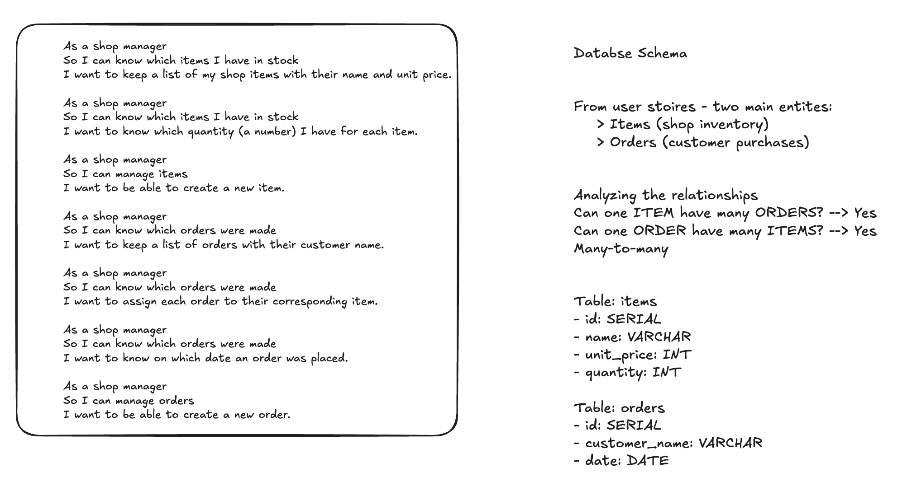

# Pet Shop Management System

A Python-based shop management system for a pet store that allows managers to track inventory items and customer orders with a many-to-many relationship structure.

## Databse schema


## Features

- **Item Management**: Add, view, and track pet shop items with prices and quantities
- **Order Management**: Create and view customer orders with dates
- **Inventory Tracking**: Monitor stock levels for each item
- **Order-Item Association**: Link multiple items to orders and view relationships
- **Interactive CLI**: User-friendly command-line interface for all operations

## Database Design

The system uses a PostgreSQL database with three main tables:
- `items`: Stores product information (name, unit_price, quantity)
- `orders`: Stores customer order details (customer_name, order_date)
- `items_orders`: Join table managing the many-to-many relationship between items and orders

For detailed information about the database design process, including user story analysis, table structure, and relationship modeling, see [design.md](design.md).


## Getting Started

### Prerequisites
- Python 3.x
- PostgreSQL
- psycopg library

### Installation

1. Create and connect to the PostgreSQL database:
```bash
createdb shop_manager
```
2. Install required dependencies:
```bash
pip install psycopg
```
3. Run the application:
```bash
python app.py
```
The application will automatically seed the database with sample pet shop data including items like squeaky toys, catnip mice, dog food, and fish supplies.

## Example Usage & Sample outputs
The CLI provides these options:

### Main menu
```bash
Welcome to our Pet Shop!
What would you like to do?
 1 = List all the shop items
 2 = Create a new item
 3 = Find the quantity for an item
 4 = List all orders
 5 = Create a new order
 6 = List items for a specific order
 7 = List the orders for a specific item
 0 = exit
Please make a choice:
```

### List all items
```bash
Please make a choice: 1
Here's a list of all shop items:
 #1 Squeaky Bone Toy - Unit price: 5 - Quantity: 50
 #2 Catnip Mouse - Unit price: 3 - Quantity: 100
 #3 Premium Dog Food - Beef - Unit price: 25 - Quantity: 30
 #4 Tropical Fish Flakes - Unit price: 7 - Quantity: 40
 #5 Hamster Wheel - Unit price: 15 - Quantity: 10
 #6 Bird Seed Mix - Unit price: 8 - Quantity: 25
 #7 Rabbit Hutch Straw - Unit price: 6 - Quantity: 15
 #8 Flea Collar - Large - Unit price: 12 - Quantity: 20
 #9 Tennis Ball Pack (3) - Unit price: 10 - Quantity: 35
 #10 Aquarium Castle Decoration - Unit price: 18 - Quantity: 5
```
### Creating a New Item (Option 2)
```bash
Please make a choice: 2
Please enter an item name
Cat Scratching Post
Please enter an item price
22
Please enter an item quantity
8
Item created
```

### Finding Item Quantity (Option 3)
```bash
Please make a choice: 3
Please enter item id
5
Item: Hamster Wheel - Quantity: 10
```

### Invalid Choice Handling
```bash
Please make a choice: 99
Invalid choice. Please try again.
```

### Exit Application (Option 0)
```bash
Please make a choice: 0
Goodbye!
```

## Testing
```
pytest
```

Tests cover:
- Model construction and equality
- Repository CRUD operations
- Database relationships
- Data integrity

```
├── app.py                    # Main application entry point
├── design.md                 # Database design documentation
├── lib/
│   ├── database_connection.py  # Database connection handler
│   ├── item.py                # Item model
│   ├── order.py               # Order model
│   ├── item_repository.py     # Item data access layer
│   └── order_repository.py    # Order data access layer
├── seeds/
│   └── shop_manager.sql       # Database schema and sample data
└── tests/                     # Test files
```

## Sample Data
The system comes pre-loaded with 10 pet shop items and 10 customer orders, demonstrating the relationships between products and purchases in a typical pet store scenario.
RetryClaude can make mistakes. Please double-check responses.

